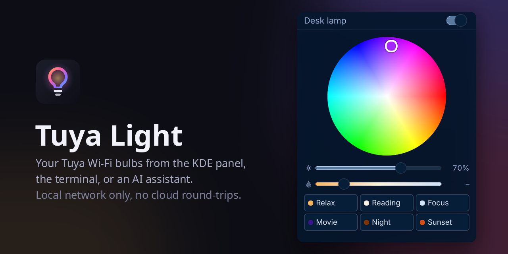
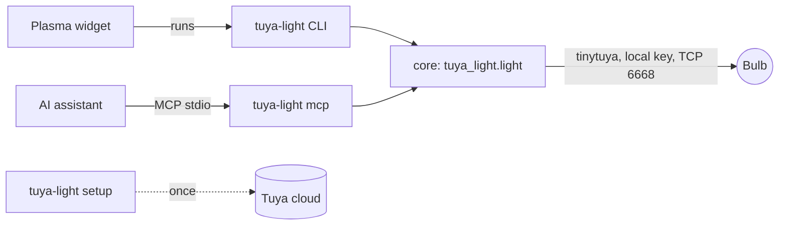

#  Tuya Light

[](https://github.com/YakupEmreYerli/tuya-light/actions/workflows/ci.yml) [](LICENSE) [](https://kde.org/plasma-desktop/) [](https://modelcontextprotocol.io)

Control Tuya Wi-Fi bulbs (Smart Life, Tuya Smart, and the many brands built on them) from three places: a KDE Plasma panel widget, a command-line tool, and an MCP server for AI assistants. All three talk to the bulb directly over your local network.

> Türkçe: [README.tr.md](README.tr.md)



The phone app goes through Tuya's cloud for every tap. Tuya Light uses the bulb's local key instead, so commands land in a few hundred milliseconds and keep working if the cloud is slow or your developer account's trial has ended. The cloud is needed once, during setup, to fetch that key.

## Features

- **Panel widget.** A bulb icon that takes the light's current colour. Click for a colour wheel, a brightness slider, a warm-to-cool white slider and six scenes. Middle-click switches the light, scrolling dims it. Several bulbs get a picker at the top.
- **Command line.** `tuya-light on`, `colour purple`, `colour '#ff8800'`, `white 60 20`, `brightness 30`, `scene movie`. Every command prints the resulting state; `--json` makes it machine-readable.
- **MCP server.** `tuya-light mcp` exposes the same controls as tools, so an assistant such as Claude can answer "make the light warmer" or "movie mode".
- **Both bulb generations.** Older bulbs (data points 1-5) and newer ones (20-24) are decoded; protocol versions 3.1 to 3.5 through [tinytuya](https://github.com/jasonacox/tinytuya).
- **Scenes:** Relax, Reading, Focus, Movie, Night, Party.
- **Translations:** English, Turkish.

## Requirements

- Linux with Python 3.10+ and [pipx](https://pipx.pypa.io)
- For the widget: KDE Plasma 6
- A Tuya developer account (free) to fetch the local keys once: see [Getting the local keys](#getting-the-local-keys)

## Install

```bash
git clone https://github.com/YakupEmreYerli/tuya-light.git && cd tuya-light
./install.sh
```

This installs the `tuya-light` command (with the MCP server) through pipx and the widget through `kpackagetool6`, for the current user only. `./install.sh --no-widget` skips the widget, `--no-mcp` leaves out the MCP dependency.

Then add the widget: right-click the panel → **Add or Manage Widgets** → **Tuya Light**.

To uninstall: `pipx uninstall tuya-light` and `kpackagetool6 -t Plasma/Applet -r com.github.yakupemreyerli.tuyalight`.

## Getting the local keys

Every Tuya bulb encrypts its local traffic with a per-device key that only the Tuya cloud knows. You fetch it once:

1. Create a free account at [platform.tuya.com](https://platform.tuya.com) and a **Cloud Project** (industry: Smart Home). Pick the data center of your app account: Central Europe for most of Europe, Western America for the US, and so on.
2. In the project: **Devices → Link App Account → Add App Account**, and scan the QR code from the Tuya / Smart Life app (**Me** → scan icon, top right).
3. Copy the **Access ID** and **Access Secret** from the project's **Overview**, and the **Device ID** of any one of your devices from the **Devices** tab.
4. Run:

   ```bash
   tuya-light setup --region eu     # eu, us, us-e, weu, in, cn
   ```

   It asks for the three values, fetches your lights' keys, looks for them on the local network, and saves the list to `~/.config/tuya-light/devices.json` (readable only by you). The ID and secret can also come from `TUYA_API_KEY` and `TUYA_API_SECRET`.

The free IoT Core trial lasts a month; after that the cloud answers "subscription has expired". Local control is unaffected. You only need the cloud again if a bulb is reset and re-paired, which changes its key; the trial can be extended for free from **Cloud → Cloud Services → IoT Core → Extend Trial Period**.

A `devices.json` written by `python -m tinytuya wizard` works as is.

## Command line

```text
tuya-light [-d DEVICE] [--json] COMMAND
```

| Command | What it does |
| --- | --- |
| `state` | Show the current state |
| `on`, `off`, `toggle` | Switch |
| `colour NAME` / `colour '#rrggbb'` / `colour H S V` | Coloured light. Names: red, orange, yellow, green, cyan, blue, purple, pink. H is 0-360, S and V 0-100 |
| `white BRIGHTNESS [TEMPERATURE]` | White light, both 0-100; temperature 0 is warm, 100 cool |
| `brightness PERCENT` | Dim or brighten, keeping the current colour or white tone |
| `temperature PERCENT` | White temperature, switches to white |
| `scene NAME` | `relax`, `reading`, `focus`, `movie`, `night`, `party` |
| `devices`, `scenes` | List what is configured |
| `setup` | Fetch local keys from the cloud (once) |
| `mcp` | Run the MCP server on stdio |

`-d` takes a device id or name and defaults to the first device. Exit codes: 0 done, 2 the light did not answer, 3 no device list yet.

## MCP server

Tools: `list_devices`, `list_scenes`, `get_state`, `turn_on`, `turn_off`, `toggle`, `set_colour`, `set_white`, `set_brightness`, `apply_scene`. Each change returns the light's new state.

Claude Code:

```bash
claude mcp add tuya-light -- tuya-light mcp
```

Claude Desktop, Cursor and other clients (`mcpServers` in their JSON config):

```json
{
  "mcpServers": {
    "tuya-light": { "command": "tuya-light", "args": ["mcp"] }
  }
}
```

## Widget settings

| Setting | Default | |
| --- | --- | --- |
| Backend command | `tuya-light` | Full path if it is not on Plasma's `PATH` |
| Device | first in the list | Id or name; the popup's picker sets it too |
| Check the light every | 60 s | Also refreshed whenever the popup opens |
| Scroll step | 5 % | Brightness change per wheel notch on the icon |

## How it works



The widget has no Python in it: it runs the CLI and reads its one-line JSON answer. While a command is running, newer ones replace each other, so dragging a slider sends the first and the last value instead of a flood.

```text
backend/     Python package: core, CLI, MCP server, tests
plasma/      the Plasma 6 widget (QML)
po/          translations
tools/       off-screen screenshots, banner, translation scripts
```

## Troubleshooting

- **"The light is not answering"**: the bulb and the computer must be on the same network and subnet; Wi-Fi extenders in between are fine. If the bulb's IP changed, rerun `tuya-light setup` or give it a fixed address in your router.
- **"No lights set up yet"**: run `tuya-light setup`.
- **"subscription has expired" during setup**: extend the free IoT Core trial (see above).
- **Setup finds 0 devices**: the app account is not linked to the cloud project, or the project's data center differs from the app's region.

## Contributing

See [CONTRIBUTING.md](CONTRIBUTING.md). Bug reports with the output of `tuya-light --json state` are the most useful.

## Credits

- [tinytuya](https://github.com/jasonacox/tinytuya) by Jason Cox (MIT) does the Tuya protocol work.
- [MCP Python SDK](https://github.com/modelcontextprotocol/python-sdk) (MIT).
- Icons in the popup come from your Plasma icon theme; the bulb icon and logo are part of this project.

Not affiliated with Tuya Inc. "Tuya" is used only to say which devices this works with.

## License

[GPL-2.0-or-later](LICENSE).
