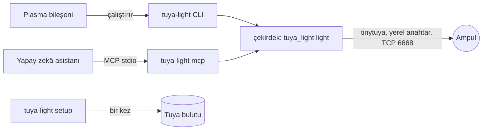

#  Tuya Light

[](https://github.com/YakupEmreYerli/tuya-light/actions/workflows/ci.yml) [](LICENSE) [](https://kde.org/plasma-desktop/)

Tuya Wi-Fi ampulleri (Smart Life, Tuya Smart ve bu altyapıyı kullanan onlarca marka) üç yerden yönetin: KDE Plasma panel bileşeni, komut satırı ve yapay zekâ asistanları için MCP sunucusu. Üçü de ampule ev ağınız üzerinden doğrudan bağlanır.

> English: [README.md](README.md)


Telefon uygulaması her dokunuşta Tuya'nın bulutuna gider. Tuya Light ise ampulün yerel anahtarını kullanır: komut birkaç yüz milisaniyede ulaşır, bulut yavaşken ya da geliştirici hesabınızın deneme süresi dolmuşken de çalışır. Bulut yalnızca kurulumda, o anahtarı almak için bir kez gerekir.

## Neler var

- **Panel bileşeni.** Ampulün o anki rengini alan bir simge. Tıklayınca renk tekerleği, parlaklık çubuğu, sıcaktan soğuğa beyaz ışık çubuğu, favori renkler ve sahneleriniz açılır. Birden fazla ampul varsa üstte seçici çıkar.
- **Kendi sahneleriniz.** Bileşenin ayarlarından sahne ekleyin, düzenleyin, gizleyin, silin ya da ışığın o anki hâlini sahne olarak kaydedin. Hazır sahneler de düzenlenir ve ilk hâline döner. Komut satırı ve MCP sunucusu aynı listeyi görür.
- **İstediğiniz gibi.** Pencerede hangi bölümlerin hangi sırayla görüneceği, teker boyutu, sahne sütunları ve favori renkler; sol tık, orta tık ve fare tekerleğinin ne yapacağı (aç, aç/kapat, bir sahne; parlaklık, sıcaklık ya da renk); panel simgesi (dört şekil, renkli ya da değil, kapalıyken soluk, yanında parlaklık).
- **Komut satırı.** `tuya-light on`, `colour purple`, `colour '#ff8800'`, `white 60 20`, `brightness 30`, `scene movie`. Ampule dokunan her komut ampulün son durumunu yazar, `--json` ile makinenin okuyacağı biçimde.
- **MCP sunucusu.** `tuya-light mcp` aynı kontrolleri araç olarak sunar; Claude gibi bir asistana "ışığı biraz ısıt" ya da "film modu" demek yeter.
- **İki ampul nesli.** Eski (veri noktaları 1-5) ve yeni (20-24) ampuller; 3.1'den 3.5'e protokol sürümleri, [tinytuya](https://github.com/jasonacox/tinytuya) üzerinden.
- **Hazır sahneler:** Rahat, Okuma, Odak, Film, Gece, Parti.
- **Diller:** İngilizce, Türkçe.

## Gerekenler

- Python 3.10+ ve [pipx](https://pipx.pypa.io) olan bir Linux
- Bileşen için KDE Plasma 6
- Yerel anahtarları bir kez almak için ücretsiz Tuya geliştirici hesabı: [Yerel anahtarları almak](#yerel-anahtarları-almak)

## Kurulum

```bash
git clone https://github.com/YakupEmreYerli/tuya-light.git && cd tuya-light
./install.sh
```

`tuya-light` komutunu (MCP sunucusuyla birlikte) pipx ile, bileşeni `kpackagetool6` ile yalnızca sizin kullanıcınıza kurar; yönetici yetkisi istemez. `./install.sh --no-widget` bileşeni atlar, `--no-mcp` MCP bağımlılığını kurmaz.

Sonra bileşeni ekleyin: panele sağ tık → **Bileşen Ekle ya da Yönet** → **Tuya Işık**.

Kaldırmak için: `pipx uninstall tuya-light` ve `kpackagetool6 -t Plasma/Applet -r com.github.yakupemreyerli.tuyalight`.

## Yerel anahtarları almak

Her Tuya ampulü yerel trafiğini yalnızca Tuya bulutunun bildiği, cihaza özel bir anahtarla şifreler. Bu anahtarı bir kez alırsınız:

1. [platform.tuya.com](https://platform.tuya.com)'da ücretsiz hesap ve bir **Cloud Project** açın (sektör: Smart Home). Veri merkezi olarak uygulama hesabınızın bölgesini seçin; Türkiye ve Avrupa'nın çoğu için Central Europe.
2. Projede **Devices → Link App Account → Add App Account** deyin, çıkan QR kodu Tuya / Smart Life uygulamasından okutun (**Ben** → sağ üstteki tarama simgesi).
3. Projenin **Overview** sekmesinden **Access ID** ve **Access Secret**'ı, **Devices** sekmesinden de cihazlarınızdan herhangi birinin **Device ID**'sini alın.
4. Çalıştırın:

   ```bash
   tuya-light setup --region eu     # eu, us, us-e, weu, in, cn
   ```

   Üç değeri sorar, ışıklarınızın anahtarlarını çeker, ağda ampulleri arar ve listeyi yalnızca sizin okuyabildiğiniz `~/.config/tuya-light/devices.json` dosyasına yazar. ID ve secret `TUYA_API_KEY` ile `TUYA_API_SECRET` ortam değişkenlerinden de verilebilir.

Ücretsiz IoT Core denemesi bir ay sürer, sonra bulut "subscription has expired" cevabı verir. Yerel kontrol bundan etkilenmez. Buluta yeniden ancak bir ampul sıfırlanıp tekrar eşleştirilirse gerek olur, çünkü anahtarı değişir. Deneme süresi **Cloud → Cloud Services → IoT Core → Extend Trial Period** yolundan ücretsiz uzatılabilir.

`python -m tinytuya wizard` ile üretilmiş bir `devices.json` olduğu gibi çalışır. İçinde yerel anahtarlar olduğu için tuya-light onu ilk okuduğunda yalnızca sizin okuyabileceğiniz hâle (0600) getirir ve bunu söyler.

## Komut satırı

```text
tuya-light [-d CİHAZ] [--json] KOMUT
```

| Komut | Ne yapar |
| --- | --- |
| `state` | Anlık durumu gösterir |
| `on`, `off`, `toggle` | Açar, kapatır, tersine çevirir |
| `colour AD` / `colour '#rrggbb'` / `colour H S V` | Renkli ışık. Adlar: red, orange, yellow, green, cyan, blue, purple, pink. H 0-360, S ve V 0-100 |
| `white PARLAKLIK [SICAKLIK]` | Beyaz ışık, ikisi de 0-100; sıcaklık 0 sıcak, 100 soğuk |
| `brightness YÜZDE` | Rengi ya da beyaz tonu koruyarak kısar, açar |
| `temperature YÜZDE` | Beyaz ışık sıcaklığı, beyaza geçer |
| `scene AD` | Adı ya da etiketiyle sahne uygular |
| `scene-save ETİKET --colour RENK\|--white SICAKLIK\|--current [--brightness N]` | Sahne oluşturur ya da üzerine yazar; `--current` ışığın o anki hâlini alır |
| `scene-remove AD` | Kendi sahnenizi siler (hazır sahne gizlenir) |
| `scene-hide AD`, `scene-show AD` | Listelerden ve bileşenden gizler, geri gösterir |
| `scene-reset [AD]` | Hazır sahneleri ilk hâline döndürür |
| `devices`, `scenes [--all]` | Tanımlı olanları listeler (`--all` gizli sahneleri de gösterir) |
| `setup [--region B] [--device-id KİMLİK] [--all]` | Yerel anahtarları buluttan alır (bir kez). `--device-id` soruyu atlar; `--all` ışık dışı cihazları da tutar |
| `mcp` | MCP sunucusunu stdio üzerinde çalıştırır |

`-d` cihaz kimliği ya da adı alır, verilmezse listedeki ilk cihaz. Çıkış kodları: 0 tamam, 2 ışık cevap vermedi, 3 cihaz listesi yok.

Sahneler `~/.config/tuya-light/scenes.json` dosyasında durur; dosyada yalnızca hazır sahnelerden farklı olanlar tutulur.

```bash
tuya-light scene-save "Kitap köşesi" --white 30 --brightness 80
tuya-light scene-save "Gün batımı" --colour '#ff6a2a' --brightness 70
tuya-light scene-save "Koyu mavi" --colour "230 80" --brightness 40   # renk tonu, doygunluk
tuya-light scene-save "Şu an" --current
tuya-light scene "kitap köşesi"
```

## MCP sunucusu

Araçlar: `list_devices`, `list_scenes`, `get_state`, `turn_on`, `turn_off`, `toggle`, `set_colour`, `set_white`, `set_brightness`, `apply_scene`, `save_scene`, `remove_scene`. Her değişiklik ışığın yeni durumunu döndürür. `save_scene` varsayılan olarak ışığın o anki hâlini kaydettiği için "bunu Akşam diye kaydet" demek yeter.

Claude Code:

```bash
claude mcp add tuya-light -- tuya-light mcp
```

Claude Desktop, Cursor ve diğerleri (JSON ayarındaki `mcpServers`):

```json
{
  "mcpServers": {
    "tuya-light": { "command": "tuya-light", "args": ["mcp"] }
  }
}
```

## Bileşen ayarları

Simgeye sağ tık → **Yapılandır…**. Dört sekme:

| Sekme | Neler ayarlanır |
| --- | --- |
| Görünüm | Pencerede hangi bölümlerin hangi sırayla görüneceği (renk tekerleği, parlaklık, beyaz ışık sıcaklığı, favori renkler, sahneler); teker boyutu; sahne sütunları; favori renkler; panel simgesinin şekli, rengi, kapalıyken solması, yanında parlaklık |
| Davranış | Sol ve orta tık: kontrolleri aç, ışığı aç/kapat, seçtiğiniz bir sahneyi uygula ya da hiçbir şey. Fare tekerleği: parlaklık, beyaz ışık sıcaklığı, renk ya da hiçbir şey; adım büyüklüğü ve yön |
| Sahneler | Kendi sahneleriniz ve hazır olanlar: ışıkta dene, düzenle (renk tekerleği ya da beyaz çubukları, "ışıktan al" ile), gizle, sil, ilk hâline döndür |
| Cihaz | Hangi ampul, ne sıklıkla kontrol edileceği, arka uç komutu, bağlantı testi |

Varsayılanlar: sol tık kontrolleri açar, orta tık ışığı açıp kapatır, tekerlek parlaklığı %5 değiştirir.

## Nasıl çalışır



Bileşenin içinde Python yok: komut satırı aracını çalıştırıp tek satırlık JSON cevabını okur. Bir komut sürerken gelen yeniler birbirinin yerine geçer; çubuğu sürüklerken ampule yüzlerce komut değil, ilk ve son değer gider.

```text
backend/     Python paketi: çekirdek, CLI, MCP sunucusu, testler
plasma/      Plasma 6 bileşeni (QML)
po/          çeviriler
tools/       pencerenin ve ayarların ekransız görüntüleri, banner, çeviri betikleri
```

## Sorun giderme

- **"Işık cevap vermiyor"**: ampul ile bilgisayar aynı ağda ve aynı alt ağda olmalı; aradaki Wi-Fi güçlendirici sorun değil. Ampulün IP'si değiştiyse `tuya-light setup`'ı yeniden çalıştırın ya da modemden ampule sabit adres verin.
- **"Henüz ışık eklenmedi"**: `tuya-light setup` çalıştırın.
- **Kurulumda "subscription has expired"**: ücretsiz IoT Core denemesini uzatın (yukarıda).
- **Kurulum 0 cihaz buluyor**: uygulama hesabı bulut projesine bağlı değil ya da projenin veri merkezi uygulamanın bölgesinden farklı.

## Katkı

[CONTRIBUTING.md](CONTRIBUTING.md)'ye bakın. Hata bildirirken `tuya-light --json state` çıktısını eklerseniz çok işe yarar.

## Emeği geçenler

- Tuya protokolünü [tinytuya](https://github.com/jasonacox/tinytuya) (Jason Cox, MIT) konuşuyor.
- [MCP Python SDK](https://github.com/modelcontextprotocol/python-sdk) (MIT).
- Penceredeki simgeler Plasma simge temanızdan gelir; ampul simgesi ve logo bu projenin.

Tuya Inc. ile bağı yoktur. "Tuya" adı yalnızca hangi cihazlarla çalıştığını söylemek için geçer.

## Lisans

[GPL-2.0-or-later](LICENSE).
